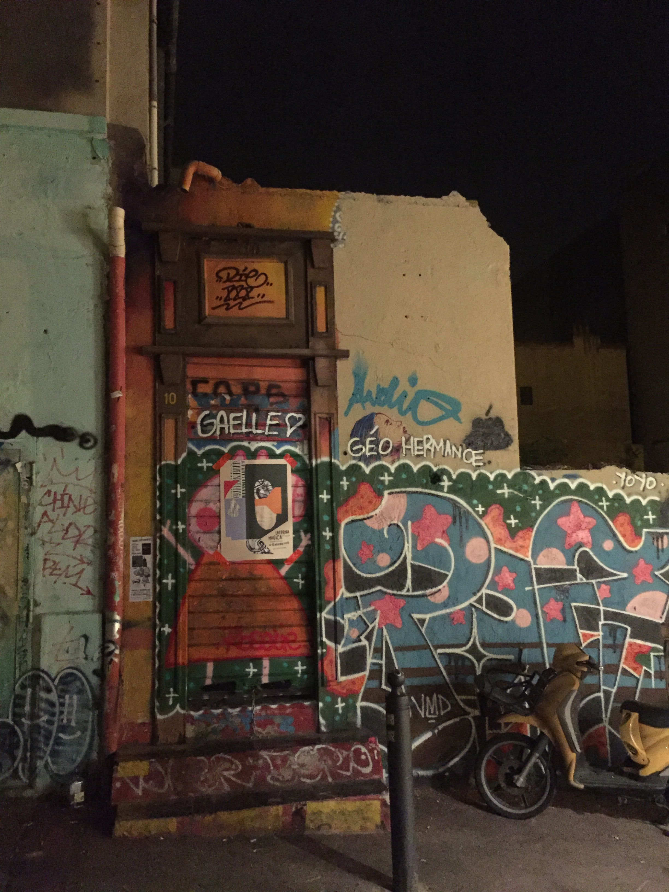

# Prendre la porte

## Inspiration initiale

Tout commence avec une photo. 

Que j'ai prise le 4 décembre dernier, en pleine nuit. C'est une photo d'une porte qui se trouve rue Crudère à Marseille (vous pouvez la voir sur Google street view, mais avec une autre "décoration"). Et cette porte ouvre sur rien. Derrière ce n'est qu'un terrain vague. 

Et, je ne pouvais pas m'empêcher de penser à cette porte. Je devais forcément écrire un truc qui en parlait.

## Background des personnages et des lieux

Théodule me plaisait bien comme nom. Et la signification était dans le ton (origine grecque, signifiant «esclave/serviteur de dieu » (de théos, « dieu », et doulos, « esclave/serviteur »). ) 

Pour le reste, je me suis donné comme contrainte d'écrire dans un décor que j'avais vraiment connu, c'est à dire Aix en Provence. Retrouver les noms de certains restos ou bars ne fut pas des plus facile. Mais j'avais envie de voila poser l'histoire dans un lieu que j'avais vraiment arpentés. 

Concernant le sans abris avec le biberon de whisky, c'est une rencontre que j'ai vraiment fait et vraiment à Aix, mais sur le cours Mirabeau, un "matin" vers 4 ou 5h du matin. (et cela devait être en 1997).

## Modification en cours d'écriture

J'étais parti pour faire un récit 'normal'. En mode on plonge dans l'histoire. Et puis je me suis dit qu'écrire plus à la façon d'une lettre, comme si il écrivait vraiment sur son carnet, ça rendrait mieux. Donc voila au final le résultat.

Au début Théodule devait mourir. Mais No' m'a fait remarqué que j'écrivais beaucoup d'histoire avec des fins plutôt malheureuse. Du coup, j'ai décidé de lui sauver la vie. Ce n'est pas vraiment une fin super heureuse mais c'est mieux que ce qui était prévu au départ.